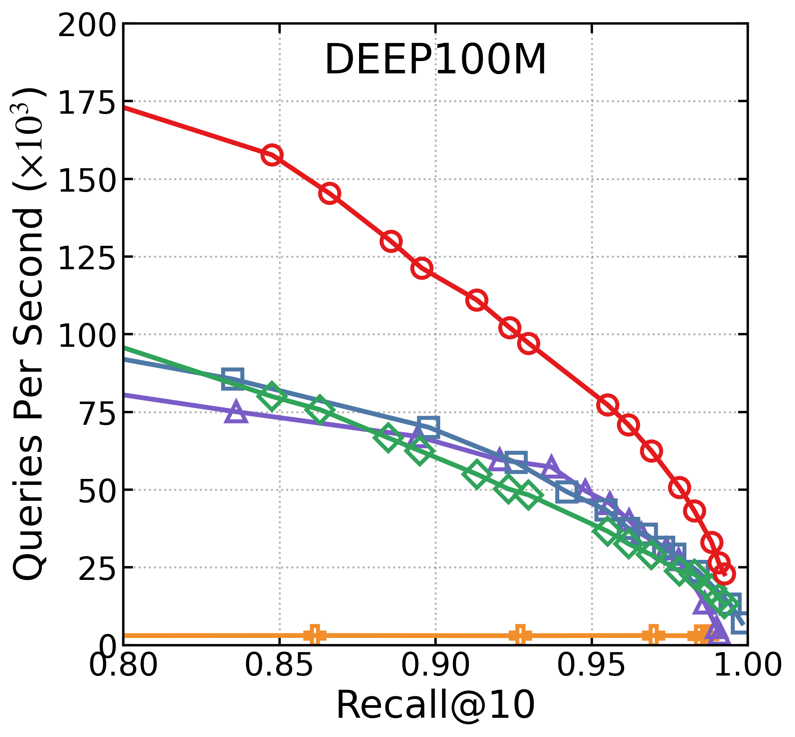
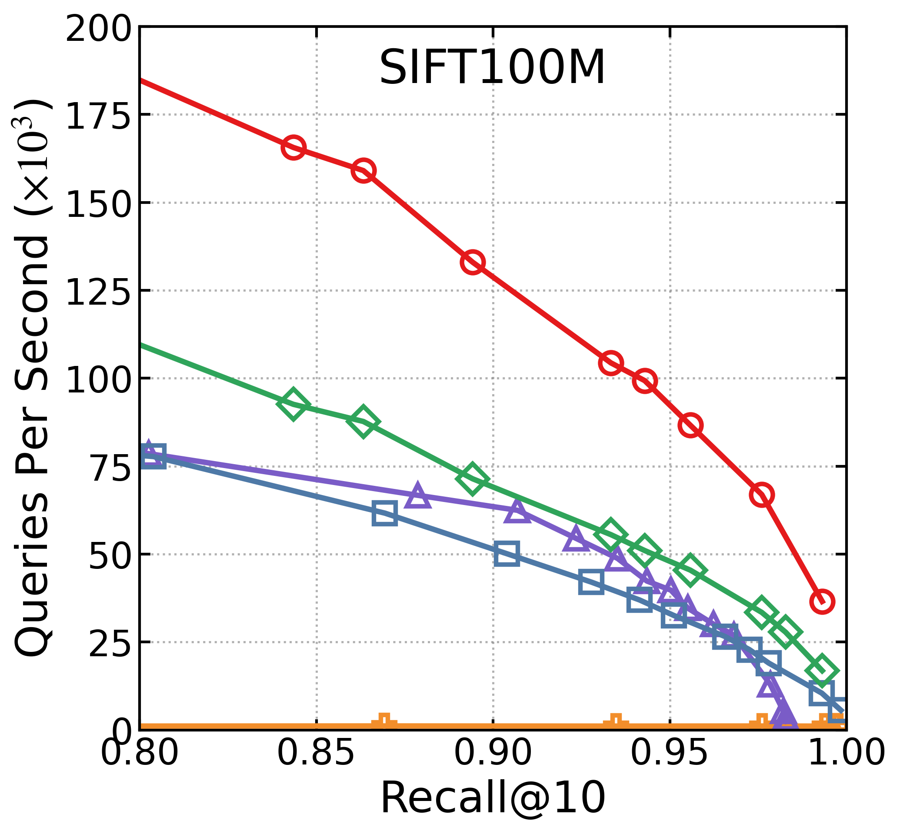
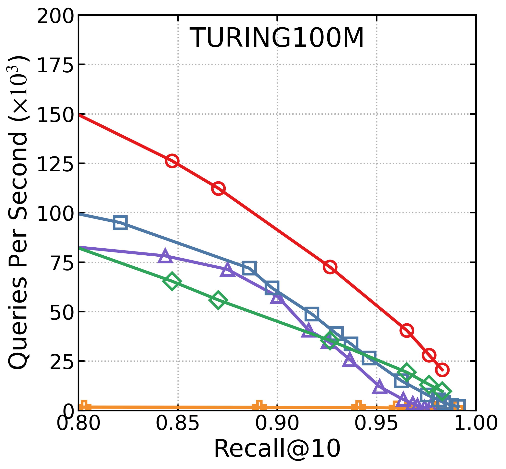
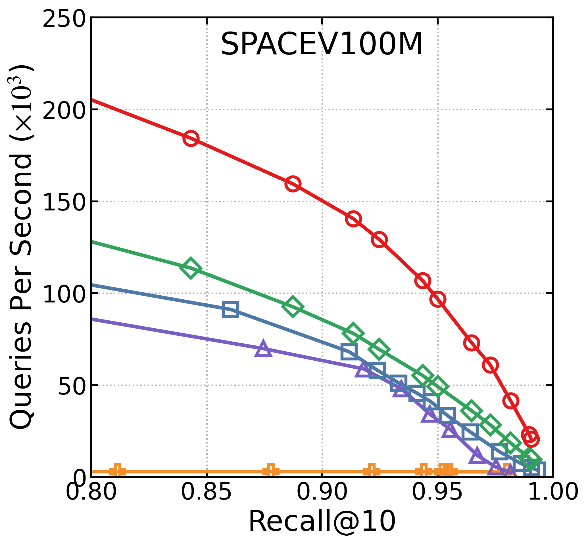
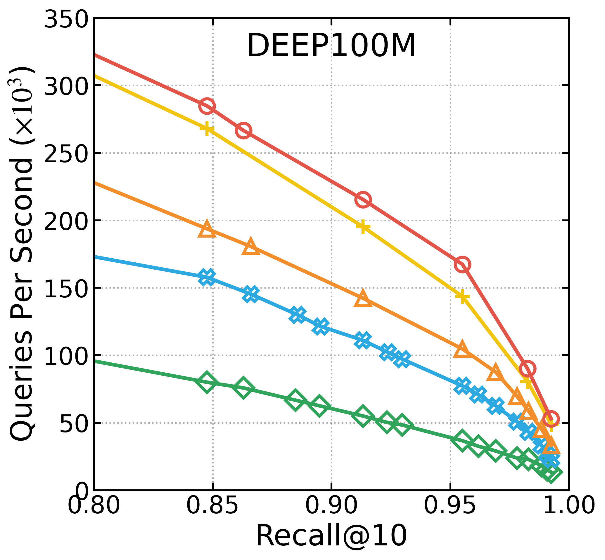
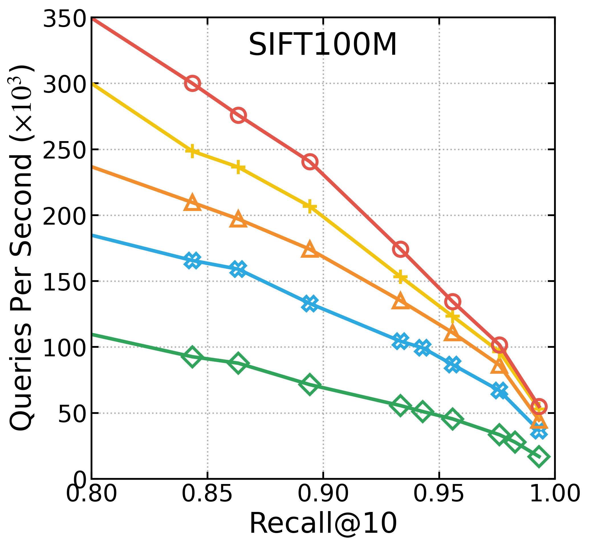
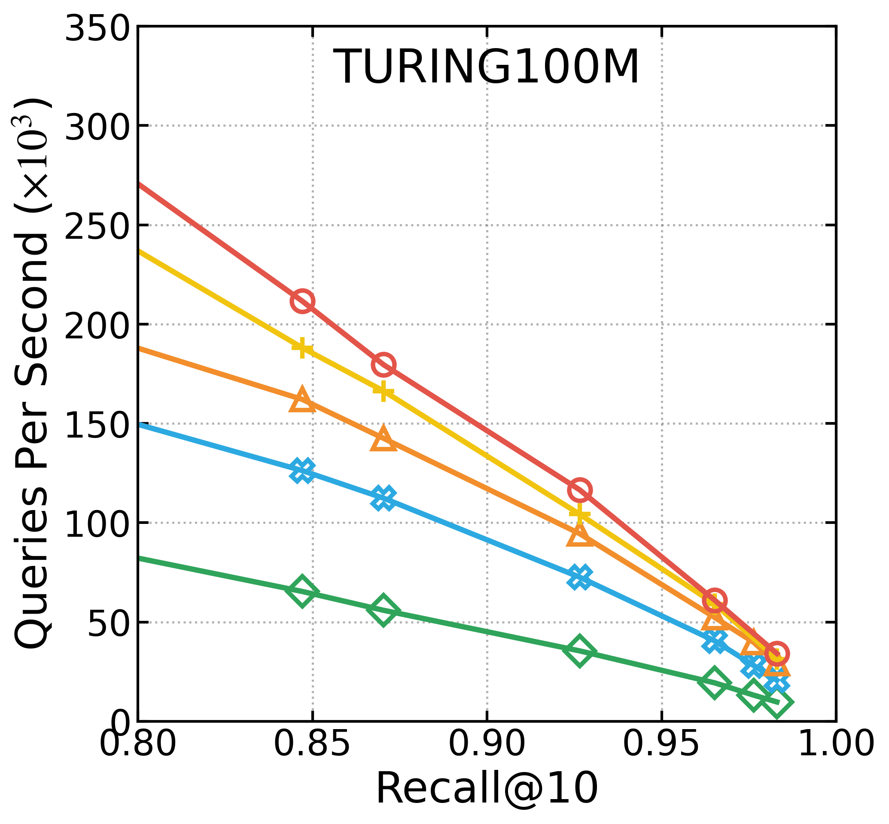

## Introduction
This project shares the pipelined heterogeneous (CPU-GPU) NN search (PH-NN Search) in C++. This method allows both the raw vectors and the graph index to be kept in CPU memory. The vectors and the graph entries are loaded into device memory when they are traversed by the queries. It, therefore, overcomes the device memory capacity constraint that the most GPU-based NN search methods face. Moreover, it also allows the search to be carried out on multiple GPUs in parallel.


## Building
To build pipnnsearch, ensure you have **CUDA Toolkit** (12.2+ recommended), **OpenMP**, and a C++11 compatible compiler installed.
```bash
$ cd pipnnsearch
$ mkdir build && cd build
$ cmake ..
$ make -j
```

## Search on the GPU
To run the search algorithm and measure its performance (QPS and Recall):
```bash
$ cd build
$ ./xgnnd_search INDEX_PREFIX QUERY_FILE GT_FILE NUM_QUERIES K DATA_TYPE DIST_FUNC BATCH_SIZE BATCH_THREADS
```

#### Parameters:
| Parameter | Description |
| :--- | :--- |
| `INDEX_PREFIX` | The path and prefix of the pre-built index files. |
| `QUERY_FILE` | Path to the query data file (binary). |
| `GT_FILE` | Path to the Ground Truth file (for recall calculation). |
| `NUM_QUERIES` | Total number of queries to be executed. |
| `K` | The number of nearest neighbors to search (Top-K). |
| `DATA_TYPE` | Data type: `uint8`, `int8`, or `float`. |
| `DIST_FUNC` | Distance function: `l2`. |
| `BATCH_SIZE` | Number of batches to split the queries into. |
| `BATCH_THREADS`| Number of CPU threads assigned to handle the batch processing. |

#### Example:
```bash
$ build/xgnnd_search \
    ./data/sift1m/index/sift1m_index \
    ./data/sift1m/sift1m_query.bin \
    ./data/sift1m/sift1m_gt.bin \
    10000 10 float l2 4 12
```


## Experimental Results

We evaluated the performance of ours method on several standard benchmark datasets. 
### Single-GPU Performance
<div align="center">
  
  <div style="margin-top: -5px;"></div> 
  
  
  
  
</div>

### Multi-GPU Performance
<div align="center">
  
  <div style="margin-top: -5px;"></div>
  
  
  
  
</div>

## Authors
The codes are fully implemented by Ben Zhang from Xiamen University.


